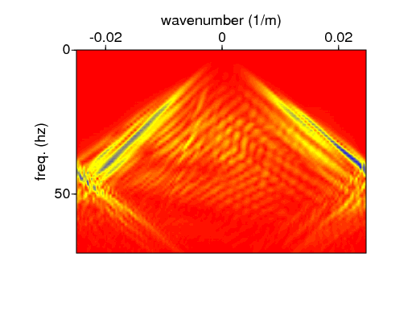
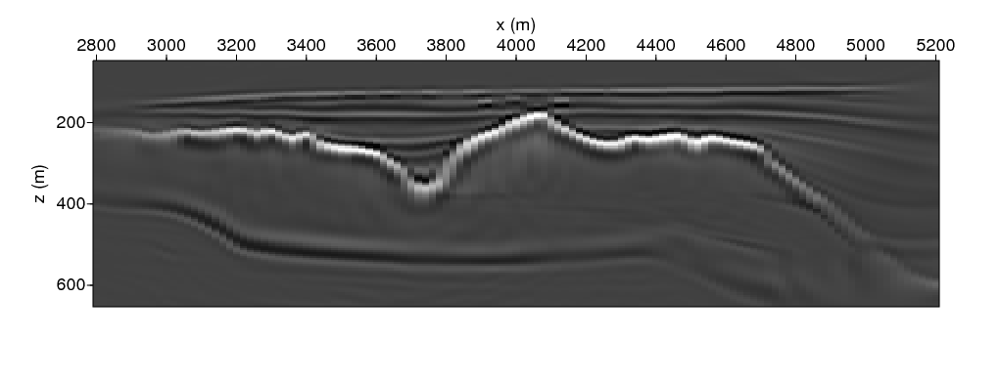

# Removing the spatial aliasing in seismic data using Deep Learning Super-Resolution
Aayush Garg, Delft University of Technology
Abe Vos, Nikita Bortych and Dr. Deepak Gupta, University of Amsterdam

## Abstract
> To do

---

## Blind data test results
Input data with spatial aliasing |  Output data without spatial aliasing
:-------------------------:|:-------------------------:
  |  
  |  

### Influence of spatial aliasing in imaging

<strong> Imaging with spatially aliased data </strong>

 

<strong> Imaging with spatially aliased removed data </strong>

---

## Repository info

### Scripts
- `train.py`: python script to train the given dataset
- `models.py`: model class definitions for SRCNN, EDSR and VDSR approaches
- `dataset.py`: implementation of the dataset class and transformations
- `mat_generation.py`: applies the trained model to the given dataset

### Folders
- `train_data`: contains the training dataset
- `blind_data`: contains the datset for the blind test
- `final/data`: contains the input and output data after training the network saved separately as training/validation/test datasets
- `results/result_2`: contains the final and intermediate results generated while training the network  

### Datasets
- The **training dataset** consist of 400 shot records generated for the [Marmousi model](https://wiki.seg.org/wiki/Dictionary:Marmousi_model) using acoustic finite-difference modelling. The input low-resolution spatially aliased dataset contains of shots with `20 m` receiver spacing and the output high-resolution contains of same shots with `10 m` receiver spacing. 
- The **blind dataset** consist of low-resolution spatially aliased shot records with `20 m` receiver spacing generated for the [Sigsbee model](http://www.ahay.org/RSF/book/gallery/sigsbee/paper_html/node1.html) using acoustic finite-difference modelling. 

**Note**: 
- We made use of freely available [`fdelmodc`](https://janth.home.xs4all.nl/Software/Software.html) program to generate the training and blind datasets.   
- You can download both the training and blind datasets using the following [google drive link](https://drive.google.com/open?id=10ohxuyZ9SdXZOqHEArSSv18IZ7PUF2ot). 

---

## Steps to train the network
- To do

---

## Steps to run the blind test
- To do

---

## Dependencies
- To do

---

## Other useful information
- To do

---
# Link test
