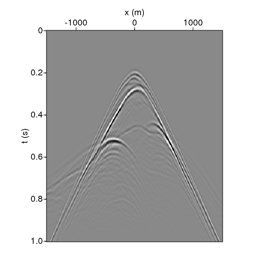
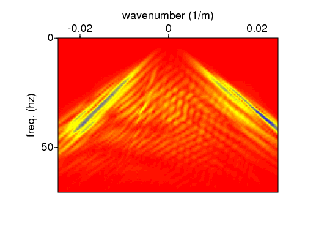
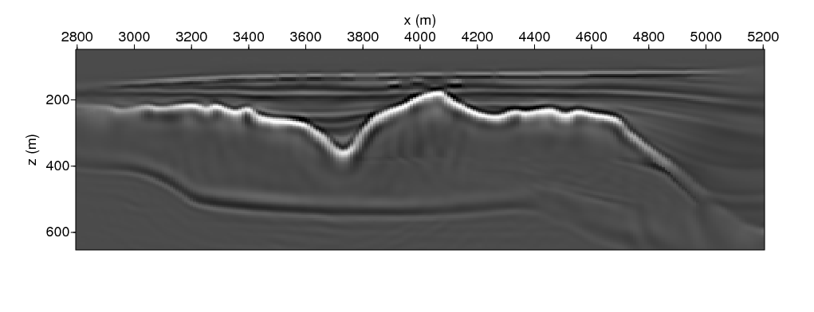

# Removing the spatial aliasing in seismic data using Deep Learning Super-Resolution
Aayush Garg, *Delft University of Technology*  
Abe Vos, Nikita Bortych and Deepak Gupta, *University of Amsterdam*

## Abstract
Seismic data is more often or not insufficiently or irregularly sampled either due to logistics and cost constraints associated with the data acquisition. The simplest case of spatial sampling problems occur when the data is regularly sampled but too sparse. The sparse sampling not just leads to the loss of high-wavenumbers, but also causes spatial aliasing due to the overlap of aliasing energy artifacts over the signal energy. 

When we image the spatially aliased data, we encounter the trade-off between the resolution of the image and aliasing artifacts. In some situations, we can reduce the aliasing artifacts by using antialiasing filters and excluding the steeply dipping events. However, this antialiasing process leads to decrease in the resolution of image. 

Here, we apply deep learning super-resolution to remove the spatial aliasing from the input seismic data. We train a modified `VDSR` network in order to up-scale the data by a factor of two in the spatial direction. Also, in order to make the trained network robust we make use of a loss function(s) that minimizes the error both in `space-time` and `f-k` domain. The trained network is able to remove the spatial aliasing and produces good qualitative and quantitative results on the blind dataset taken from different geological setting. 

---

## Blind data test results
Input data with spatial aliasing |  Output data without spatial aliasing
:-------------------------:|:-------------------------:
  |  
  |  

### Influence of spatial aliasing in imaging
<p align="center"><strong> Imaging with spatially aliased blind data </strong></p>

 


<p align="center"><strong> Imaging with spatial aliasing removed blind data </strong></p>



---

## Repository info

### Scripts
- `train.py`: python script to train the given dataset
- `models.py`: model class definitions for SRCNN, EDSR and VDSR approaches
- `dataset.py`: implementation of the dataset class and transformations
- `mat_generation.py`: applies the trained model to the given dataset

### Folders
- `train_data`: contains the training dataset
- `blind_data`: contains the datset for the blind test
- `final/data`: contains the input and output data after training the network saved separately as training/validation/test datasets
- `results/result_2`: contains the final and intermediate results generated while training the network  

### Datasets
- The **training dataset** consist of 400 shot records generated for the [Marmousi model](https://wiki.seg.org/wiki/Dictionary:Marmousi_model) using acoustic finite-difference modelling. The input low-resolution spatially aliased dataset contains of shots with `20 m` receiver spacing and the output high-resolution contains of same shots with `10 m` receiver spacing. 
- The **blind dataset** consist of low-resolution spatially aliased shot records with `20 m` receiver spacing generated for the [Sigsbee model](http://www.ahay.org/RSF/book/gallery/sigsbee/paper_html/node1.html) using acoustic finite-difference modelling. 

**Note**: 
- We made use of freely available [`fdelmodc`](https://janth.home.xs4all.nl/Software/Software.html) program to generate the training and blind datasets.   
- You can download both the training and blind datasets using the following [google drive link](https://drive.google.com/open?id=10ohxuyZ9SdXZOqHEArSSv18IZ7PUF2ot). 

---

## Steps to train the network and run the blind test
1. First of all, ensure you have the correct python environment and dependencies to run the scripts (see below).

2. Clone/Download the repository and navigate to the downloaded folder.
```sh
$ git clone https://github.com/garg-aayush/spatial-alias-removal
$ cd spatial-alias-removal
```

3. Download the datasets from the [google drive link](https://drive.google.com/open?id=10ohxuyZ9SdXZOqHEArSSv18IZ7PUF2ot) and add to the respective directories in the `spatial-alias-removal`

4. In order to train the network run
```sh
#It assumes you have access to GPU
$ python train.py -d train_data -x data_20_big -y data_10_big -n 1 --device cuda:0 --n_epochs 50
```

5. Then, use the trained network to remove spatial aliasing from the blind dataset
```sh
#It assumes you have access to GPU 
$ python mat_generation.py --data_root blind_data -x data_20_big --model_folder results/result_2 --device cuda:0 
```
---

## Useful information
- The above mentioned steps were followed exactly along with the other mentioned parameters in the scripts to generate the results for the current repository.

- You can get more information about the various parameters in the scripts either by going through the scripts or else
```sh
$ python train.py -h
$ python mat_generation.py -h
```

- The scripts assumes the training/blind datasets to be in `nt X nr X ns` size saved in `.mat` format. The network was trained for input sample example of `251 X 151` size and output sample example of `251 X 301` size. We have not tested the network for different size examples.

- You can directly use the trained network (already saved in `results/result_2`) directly without training by skipping the *step 4* in the above section.

- Note, the scripts assume that you have access to GPU for training the data. In case, if you don't have access to GPU, change `--device cuda:0` to `--device cpu` while running the scripts. We recommend to train the network on a GPU, otherwise it will take quite a long time to train the network.

---
## Dependencies
The scripts depends requires the following packages:
- [Python 3.6](https://www.python.org/downloads/release/python-360/)
- [PyTorch](https://pytorch.org/)
- [Torchvision](https://pytorch.org/)
- [matplotlib](https://matplotlib.org/)
- [SciPy](https://www.scipy.org/)
- [Hyperopt](https://github.com/hyperopt/hyperopt)
- [pytorch-ssim](https://github.com/Po-Hsun-Su/pytorch-ssim) 

The best practice is to create a [conda](https://www.anaconda.com/) environment with the following packages before running the scripts.

---
